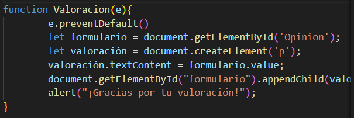

# Mundo Videojuegos

La temática de este proyecto es una Web sobre videojuegos,

## Mis html y sus Script

En esta sección de la Web he explicado mediante ejemplos la historia de los videojuegos con sus primeros representantes.
A su vez en esta parte de la Web he usado Js para ocultar y mostrar texto.
- [Index](Index.html)

- [Script_Index](./Js/MostrarElementosOcultos.js)

En esta sección de la Web he mostrado las principales consolas de la compañia Nintendo y explicado su evolucion en cuanto a innovaciones que trajeron. En este html he implementado mediante Js un script para cambiar el color del fondo de la Web.
- [Nintendo](Nintendo.html)
- [Script_Nintendo](./Js/CmbioColorWeb.js)

En esta sección de la Web he mostrado las principales consolas de la compañia Sony y explicado su evolucion en cuanto a innovaciones que trajeron. En este html he implementado mediante un formulario y mediante Js un apartado de valoración que al enviarlo salta una alerta dando las gracias por la valoración y añade un parrado al body con dicha valoracion.

- [Sony](Sony.html)
- [Script_Sony](./Js/FormularioAlert.js)

En esta sección de la Web he creado un html que muestre algunos de los videojuegos más populares. En este Html he implemenntado un script mediante el cual podemos ir cambiando varias imágenes hacia delante o hacia atras pulsando un botón.

- [JuegosConocidos](JuegosConocidos.html)
- [Script_JuegosConocidos](./Js/imagenesDelante.js)

## Css del Proyecto

El estilo que le he dado a mis html con Css es muy parecido en todas las páginas por lo que explicaré las dos más relevantes para que se entienda lo que he hecho.

- [Css-Index](Index.css)

Para empezar he diseñado mis Css de manera que en un inicio los html se adapten perfectamente a pantallas pequeñas. Más adelante para estilizarlos para las páginas con ventanas grandes he usado las "media query".

Aqui aplico unos estilo básicos que quiero usar en toda la página.

A continuacion diseño como quiero que se vea el logo de la Web y selecciono el color de fondo que le quiero dar al header y le doy forma a la etiqueta "Contenido_No_Fijo".

Para terminar con el header le he dado estilo y forma a la barra de navegación y he implementado hover a las "a" es decir los enlaces para que cambien de color al pasar el cursor por encima.

Como se puede observar en la siguiente imagen he marcado como quiero que sean mis h y mis párrafos y he diseñado como quiero que se vean mis botones.

Aqui marco cual es Margen automatico y lo maximo a lo que se expande el texto del contenido de la clase seleccionada.

En la siguiente imagen le doy forma a la ID historia, le digo el espacio de pantalla que quiero que ocupe y mediante "background-image: linear-gradient" hago que esta seccion tenga una imagen de fondo y que sobre esta seproyecte una sobra de manera que sea más oscura y se pueda leer con mayor facilidad el texto que hay sobre la imagen. Esta misma fórmula la he aplicado para poner fotos de fondo en las otras paginas y en esta más adelante.

En la siguiente imagen mediante la etiqueta "Lista" y sus respectivos "Child" he asignado las Backgrauns-image a los elementos de dicha clase.

Para finalizar con este Css tenemos el footer y las media query usadas.

Aqui indicamos como queremos que se vea la Web a partir del tamaño especificadoy haemos que el header baje al bajar por la página.

- [Css-JuegosConocidos](JuegosConocidos.css)

Lo que tiene este Css y esta pagina Web de especial es que he asignado etiquetas a fotos para ejecutar el script y que al pasar las fotos cambie la foto de fondo que esta asignada en cada momento.

He creado una clase por cada foto. Antes de probar esto he probado a hacer una lista con las fotos en el script y después la idea era que al hacer click fuese pasando las imágenes pro no he conseguido que quede bonito y se me ha ocurrido esta idea.

## Scripts
Este script es bastante simple lo que hace es cambiar el nombre del boton al pulsarlo y procede a cambiar el color de fondo de la página, luego comprueba si ha cambiado y si es así al darle al botón de nuevo vuelve a cambiar.
- [CambioDeColor](./Js/CmbioColorWeb.js)

El siguiente script tambien es bastante sencillo, ño que hace es recoger lo que se escribe dentro del formulario, al enviarlo devuelve una alerta dando las gracias por la valoración y añade lo introducido en forma de párrafo dentro del body.

El script que se ve a continuación lo que hace es acceder a las fotos mediante la clase que le hemos dado y con el css las ponemos en nuestro html. Al pulsar siguiente carga la imagen siguiente y al pulsar anterior te muestra la imagen previa a la que estás viendo.

Este último script se encarga de ocultar y mostrar un texto que de base está ocukti por el Css y al pulsar el boton cumprueba si antes del botón hay texto cambia el botón a ocultar y si no hay texto antes del botón el botón vuelve a cambiar a como estaba antes.

